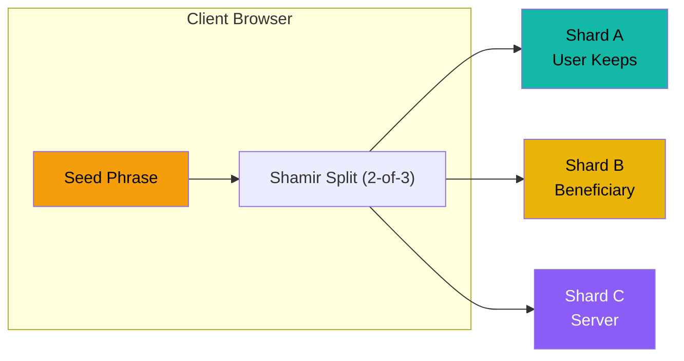
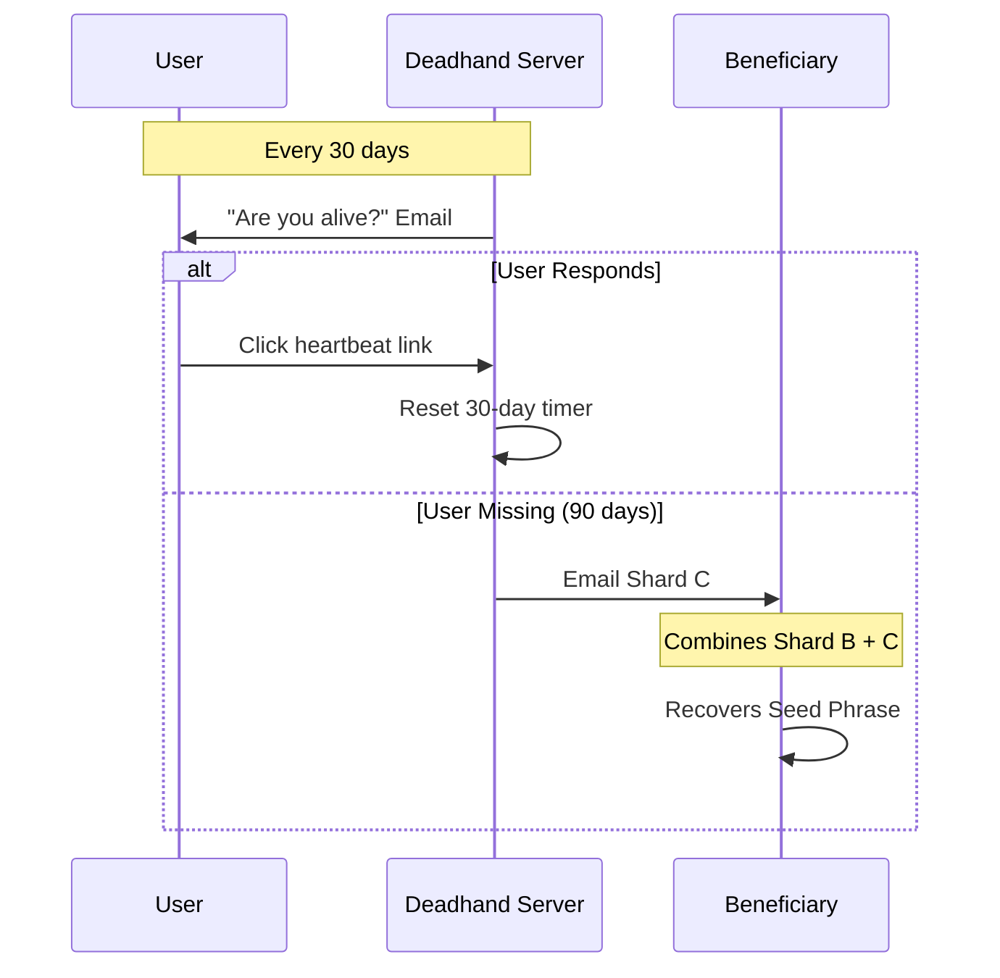
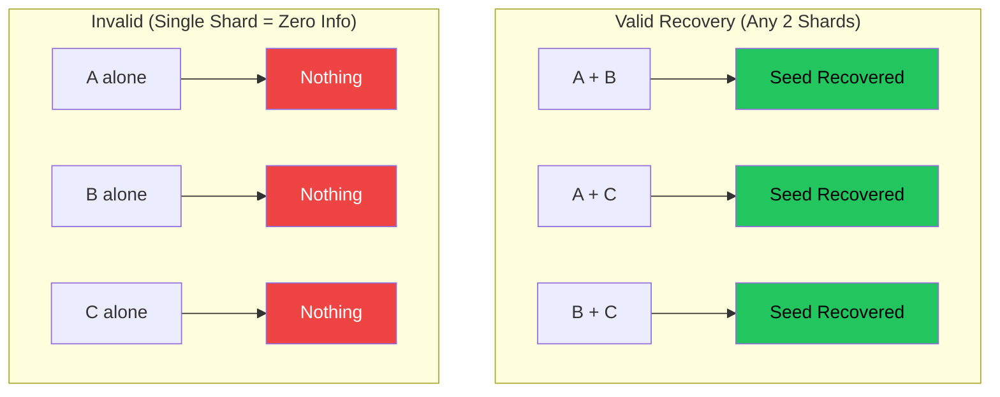
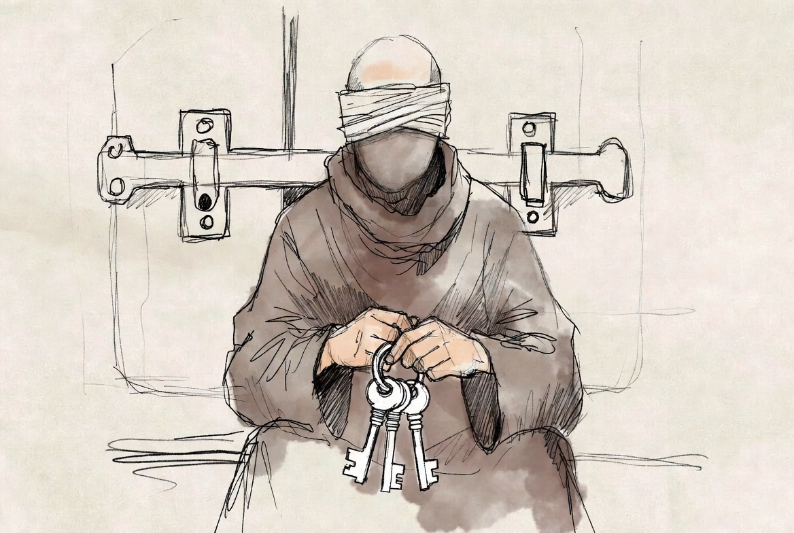
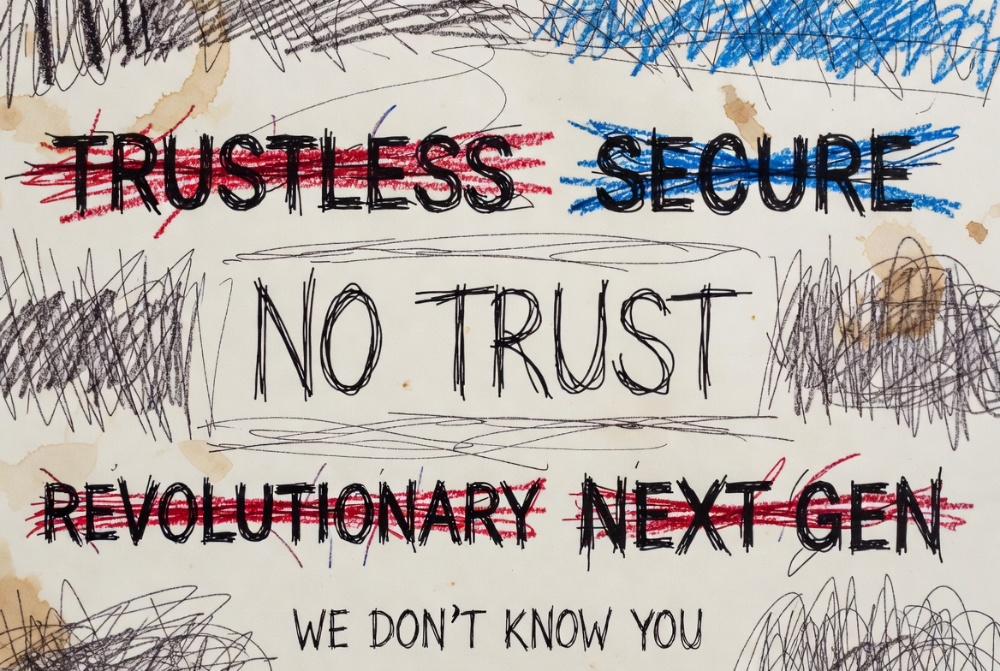

<p align="center">
  <a href="https://www.youtube.com/watch?v=iqqpPJqMano">
    
  </a>
  <br>
  <em>▶️ Watch: What happens to your crypto when you die?</em>
</p>

# Deadhand

<p align="center">
  
  
  
  
  <br><br>
  <a href="https://deepwiki.com/pyoneerC/Deadhand"></a>
  <a href="https://www.shipit.buzz/products/dead?ref=badge" target="_blank"></a>
  <a href="https://www.producthunt.com/products/shardium?utm_source=badge-featured&utm_medium=badge&utm_campaign=badge-shardium" target="_blank"></a>
</p>

### Trustless dead man's switch for crypto inheritance using Shamir's Secret Sharing

---

## The Problem

You die. Your crypto dies with you. Your family has no idea how to access it.

Traditional solutions require trusting someone with your seed phrase. That's not acceptable.

## The Solution

Deadhand uses **Shamir's Secret Sharing** to split your seed phrase into 3 shards. No single entity (including us) has the full key.

> *Inspired by [@PixOnChain](https://x.com/PixOnChain/status/2000589935980458262)*

## Features

- **Client-Side Encryption** - Your seed phrase never leaves your browser unencrypted
- **Shamir's Secret Sharing** - Mathematically proven 2-of-3 threshold scheme
- **Automated Dead Man's Switch** - 30-day heartbeat checks, triggers after 90 days
- **PDF Export** - Print shards for physical backup
- **Beneficiary System** - Seamless crypto inheritance
- **Zero Trust Architecture** - Even we can't access your keys
- **Source-Available** - Inspect the full code, but commercial use requires a subscription


## How It Works

### Shard Distribution



### Dead Man's Switch Flow



### Recovery Combinations



### Trust Model

| Scenario | Outcome |
|----------|---------|
| Server hacked | Attacker has only Shard C → **Useless** |
| Beneficiary is malicious | They have only Shard B → **Useless** |
| You lose Shard A | Combine B + C → **Still recoverable** |
| You die | Server sends C to beneficiary → **B + C = Recovery** |

<p align="center">
  
</p>

---

### Tech Stack

*   **Backend**: FastAPI, PostgreSQL, SQLAlchemy
*   **Frontend**: HTML, TailwindCSS, HTMX
*   **Cryptography**: `secrets.js` (Shamir's Secret Sharing) running in browser
*   **Hosting**: Vercel

### How to Run

1.  Install dependencies:
    ```bash
    pip install -r requirements.txt
    ```

2.  Run the server:
    ```bash
    python -m uvicorn app.main:app --reload --port 8000
    ```

3.  Visit `http://localhost:8000`

---

### Security Note

<p align="center">
  
</p>

This is an MVP/Proof of Concept. In a real production environment:
*   Use HTTPS.
*   Audit the `secrets.js` library.
*   Ensure the database is secure.
*   Use a real email provider (SendGrid/AWS SES) instead of the mock logger.

---

<p align="center">
  <b>Built by the Deadhand Team</b>
</p>

---

## Contributing

Contributions are welcome! Here's how you can help:

1. **Fork** the repository
2. **Create** a feature branch (`git checkout -b feature/amazing-feature`)
3. **Commit** your changes (`git commit -m 'Add amazing feature'`)
4. **Push** to the branch (`git push origin feature/amazing-feature`)
5. **Open** a Pull Request

### Areas We Need Help With:
- [ ] Production-grade email integration
- [ ] Multi-language support
- [ ] Mobile app wrapper
- [ ] Hardware wallet integration
- [ ] Additional threshold schemes (3-of-5, etc.)

---

## License

This project is licensed under the **Business Source License 1.1 (BSL 1.1)**.

### What This Means

| Use Case | Allowed? |
|----------|----------|
| Personal use | ✅ Free |
| Security auditing | ✅ Free |
| Educational/research | ✅ Free |
| Non-commercial self-hosting | ✅ Free |
| Commercial/production use | ❌ Requires Commercial License |

### Change Date

On **January 28, 2030**, this code automatically converts to **AGPL v3.0** (fully open source).

### Why BSL?

We believe security software should be transparent. You should be able to verify that your seed phrase is safe by reading the code yourself. But building and maintaining security infrastructure is expensive. BSL ensures:

1. **Trust**: Anyone can audit the code
2. **Sustainability**: The project can be maintained long-term
3. **Eventual Freedom**: Code becomes open source after 4 years

For commercial licensing: **max@deadhandprotocol.com**

See [LICENSE](./LICENSE) for full terms.

---

<p align="center">
  <b>Star this repo if you find it useful!</b>
</p>
