<p align="center">
  
</p>

# Shardium

<p align="center">
  
  
  
  
</p>

### 🔐 Trustless dead man's switch for crypto inheritance using Shamir's Secret Sharing

---

## The "Trustless Dead Man's Switch"

Shardium is a SaaS concept that uses **Shamir's Secret Sharing** to split a crypto seed phrase into 3 shards. It ensures that no single entity (including the server) has the full key, solving the "Trust Paradox."

> 💡 *Inspired by [@PixOnChain](https://x.com/PixOnChain/status/2000589935980458262)*

## ✨ Features

- 🔐 **Client-Side Encryption** - Your seed phrase never leaves your browser unencrypted
- 🧩 **Shamir's Secret Sharing** - Mathematically proven 2-of-3 threshold scheme
- 📧 **Automated Dead Man's Switch** - 30-day heartbeat checks, triggers after 90 days
- 🖨️ **PDF Export** - Print shards for physical backup
- 👥 **Beneficiary System** - Seamless crypto inheritance
- 🚫 **Zero Trust Architecture** - Even we can't access your keys
- 🌐 **Fully Open Source** - Audit the code yourself


## How It Works

### Shard Distribution

```mermaid
flowchart LR
    subgraph Browser["🌐 Client Browser"]
        SEED["🔑 Seed Phrase"]
        SPLIT["Shamir Split (2-of-3)"]
    end
    
    SEED --> SPLIT
    SPLIT --> A["🟢 Shard A<br/>User Keeps"]
    SPLIT --> B["🟡 Shard B<br/>Beneficiary"]
    SPLIT --> C["🟣 Shard C<br/>Server"]
    
    style SEED fill:#f59e0b,color:#000
    style A fill:#14b8a6,color:#000
    style B fill:#eab308,color:#000
    style C fill:#8b5cf6,color:#fff
```



### Dead Man's Switch Flow

```mermaid
sequenceDiagram
    participant U as 👤 User
    participant S as 🖥️ Shardium Server
    participant B as 👥 Beneficiary

    Note over U,S: Every 30 days
    S->>U: 📧 "Are you alive?" Email
    
    alt User Responds
        U->>S: ✅ Click heartbeat link
        S->>S: Reset 30-day timer
    else User Missing (90 days)
        S->>B: 🚨 Email Shard C
        Note over B: Combines Shard B + C
        B->>B: 🔓 Recovers Seed Phrase
    end
```



### Recovery Combinations


### Trust Model

| Scenario | Outcome |
|----------|---------|
| 🖥️ Server hacked | Attacker has only Shard C → **Useless** |
| 👥 Beneficiary is malicious | They have only Shard B → **Useless** |
| 👤 You lose Shard A | Combine B + C → **Still recoverable** |
| 💀 You die | Server sends C to beneficiary → **B + C = Recovery** |

<p align="center">
  
</p>

---

### Tech Stack

*   **Backend**: FastAPI, SQLite, SQLAlchemy
*   **Frontend**: HTML, TailwindCSS, HTMX
*   **Cryptography**: `secrets.js` (Shamir's Secret Sharing) running in browser.

### How to Run

1.  Install dependencies:
    ```bash
    pip install -r requirements.txt
    ```

2.  Run the server:
    ```bash
    python -m uvicorn app.main:app --reload --port 8000
    ```

3.  Visit `http://localhost:8000`

---

### Security Note

<p align="center">
  
</p>

This is an MVP/Proof of Concept. In a real production environment:
*   Use HTTPS.
*   Audit the `secrets.js` library.
*   Ensure the database is secure.
*   Use a real email provider (SendGrid/AWS SES) instead of the mock logger.

---

<p align="center">
  <b>Built with 🔐 by the Shardium Team</b>
</p>

---

## 🤝 Contributing

Contributions are welcome! Here's how you can help:

1. **Fork** the repository
2. **Create** a feature branch (`git checkout -b feature/amazing-feature`)
3. **Commit** your changes (`git commit -m 'Add amazing feature'`)
4. **Push** to the branch (`git push origin feature/amazing-feature`)
5. **Open** a Pull Request

### Areas We Need Help With:
- [ ] Production-grade email integration
- [ ] Multi-language support
- [ ] Mobile app wrapper
- [ ] Hardware wallet integration
- [ ] Additional threshold schemes (3-of-5, etc.)

---

## 📄 License

This project is licensed under the **MIT License** - see below for details:

```
MIT License

Copyright (c) 2024 Shardium

Permission is hereby granted, free of charge, to any person obtaining a copy
of this software and associated documentation files (the "Software"), to deal
in the Software without restriction, including without limitation the rights
to use, copy, modify, merge, publish, distribute, sublicense, and/or sell
copies of the Software, and to permit persons to whom the Software is
furnished to do so, subject to the following conditions:

The above copyright notice and this permission notice shall be included in all
copies or substantial portions of the Software.

THE SOFTWARE IS PROVIDED "AS IS", WITHOUT WARRANTY OF ANY KIND, EXPRESS OR
IMPLIED, INCLUDING BUT NOT LIMITED TO THE WARRANTIES OF MERCHANTABILITY,
FITNESS FOR A PARTICULAR PURPOSE AND NONINFRINGEMENT. IN NO EVENT SHALL THE
AUTHORS OR COPYRIGHT HOLDERS BE LIABLE FOR ANY CLAIM, DAMAGES OR OTHER
LIABILITY, WHETHER IN AN ACTION OF CONTRACT, TORT OR OTHERWISE, ARISING FROM,
OUT OF OR IN CONNECTION WITH THE SOFTWARE OR THE USE OR OTHER DEALINGS IN THE
SOFTWARE.
```

---

<p align="center">
  <b>⭐ Star this repo if you find it useful! ⭐</b>
</p>
