<p align="center">
  
</p>

# Shardium

### 🔐 Trustless dead man's switch for crypto inheritance using Shamir's Secret Sharing

## The "Trustless Dead Man's Switch"

Shardium is a SaaS concept that uses **Shamir's Secret Sharing** to split a crypto seed phrase into 3 shards. It ensures that no single entity (including the server) has the full key, solving the "Trust Paradox."

## How It Works

### Shard Distribution

```mermaid
flowchart LR
    subgraph Browser["🌐 Client Browser"]
        SEED["🔑 Seed Phrase"]
        SPLIT["Shamir Split (2-of-3)"]
    end
    
    SEED --> SPLIT
    SPLIT --> A["🟢 Shard A<br/>User Keeps"]
    SPLIT --> B["🟡 Shard B<br/>Beneficiary"]
    SPLIT --> C["🟣 Shard C<br/>Server"]
    
    style SEED fill:#f59e0b,color:#000
    style A fill:#14b8a6,color:#000
    style B fill:#eab308,color:#000
    style C fill:#8b5cf6,color:#fff
```



### Dead Man's Switch Flow


### Recovery Combinations

```mermaid
flowchart TB
    subgraph Valid["✅ Valid Recovery (Any 2 Shards)"]
        AB["A + B"] --> RECOVER1["🔓 Seed Recovered"]
        AC["A + C"] --> RECOVER2["🔓 Seed Recovered"]
        BC["B + C"] --> RECOVER3["🔓 Seed Recovered"]
    end
    
    subgraph Invalid["❌ Invalid (Single Shard = Zero Info)"]
        A1["A alone"] --> FAIL1["🔒 Nothing"]
        B1["B alone"] --> FAIL2["🔒 Nothing"]
        C1["C alone"] --> FAIL3["🔒 Nothing"]
    end
    
    style RECOVER1 fill:#22c55e,color:#000
    style RECOVER2 fill:#22c55e,color:#000
    style RECOVER3 fill:#22c55e,color:#000
    style FAIL1 fill:#ef4444,color:#fff
    style FAIL2 fill:#ef4444,color:#fff
    style FAIL3 fill:#ef4444,color:#fff
```



### Trust Model

| Scenario | Outcome |
|----------|---------|
| 🖥️ Server hacked | Attacker has only Shard C → **Useless** |
| 👥 Beneficiary is malicious | They have only Shard B → **Useless** |
| 👤 You lose Shard A | Combine B + C → **Still recoverable** |
| 💀 You die | Server sends C to beneficiary → **B + C = Recovery** |


### Tech Stack

*   **Backend**: FastAPI, SQLite, SQLAlchemy
*   **Frontend**: HTML, TailwindCSS, HTMX
*   **Cryptography**: `secrets.js` (Shamir's Secret Sharing) running in browser.

### How to Run

1.  Install dependencies:
    ```bash
    pip install -r requirements.txt
    ```

2.  Run the server:
    ```bash
    python -m uvicorn app.main:app --reload --port 8000
    ```

3.  Visit `http://localhost:8000`

### Security Note

This is an MVP/Proof of Concept. In a real production environment:
*   Use HTTPS.
*   Audit the `secrets.js` library.
*   Ensure the database is secure.
*   Use a real email provider (SendGrid/AWS SES) instead of the mock logger.
